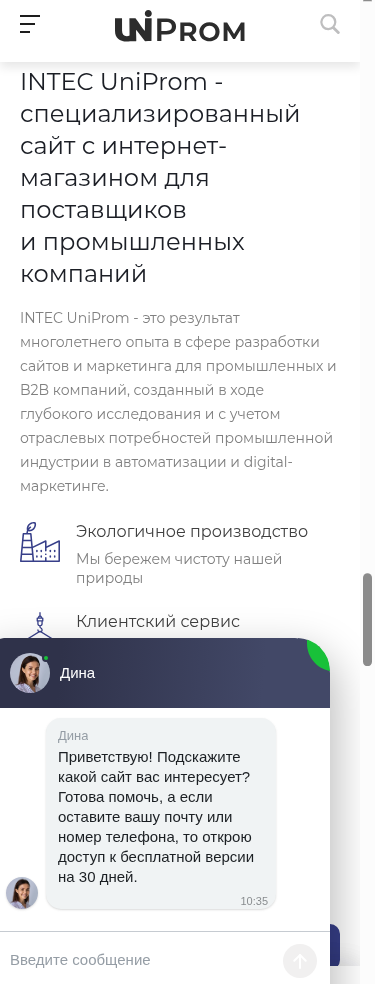

# Список графических материалов сайта Barus.Tools (шаблон INTEC.Prom)

1. Подложка баннера слайдера (главная)

Где используется: https://barus.skalkindmitriy.ru/ , первый экран, слайдер под шапкой.

Описание: широкая подложка слайда во всю ширину экрана. Заголовок, текст и кнопка рисуются шаблоном поверх картинки слева, поэтому левая треть должна оставаться спокойной, без мелких деталей и без своего текста. Под мобильную версию грузится отдельный файл: у него другая пропорция, и на десктопном варианте его не видно.

Размер оригинала для загрузки: 3116x1203 для десктопа. Для мобильной версии на тестовом сайте лежат два разных файла, 1829x860 и 1064x779.

Как режется на сайте: не режется, оба файла выводятся как есть, в исходном размере.

Формат: WebP для десктопа. Мобильные файлы на тестовом сайте лежат в WebP (1064x779) и JPEG (1829x860).

Демо-пример: https://www.promcrm.ru/upload/iblock/f1b/ev02tew83088zonyl3b6axwucnwnupag.webp , мобильные https://www.promcrm.ru/upload/iblock/b9d/kezyy4e91ihwky37dk47ik7n0q2ouqph.webp и https://www.promcrm.ru/upload/iblock/adc/amdks784al3p2tpwxiryzw7hb63a89xh.webp

Пример у нас: https://barus.skalkindmitriy.ru/upload/iblock/7e6/44881xpefpk9zsjt3h46wjwp8px12vgh.webp , мобильные https://barus.skalkindmitriy.ru/upload/iblock/002/yl9u2tkdb7rc301lbrsdib1mr2hev8tu.webp и https://barus.skalkindmitriy.ru/upload/iblock/b85/fg8syle38v5xqh222j9rrv5ehw040jba.jpg

Сколько нужно: по паре файлов (десктоп и мобайл) на каждый слайд. На тестовом сайте засняты 1 десктопная подложка и 2 мобильные.

---

2. Вырезанный объект для мобильного баннера (главная)

Где используется: мобильная версия слайдера на главной, отдельное поле поверх мобильной подложки.

Описание: вырезанный предмет или коллаж без фона, который ложится поверх мобильной подложки. Нужен PNG или WebP с прозрачностью, по краям объекта не должно быть белой каймы. Композиция вертикальная, объект смотрится крупно.

Размер оригинала для загрузки: 853x731 (по демо-файлу).

Как режется на сайте: не режется, выводится как есть.

Формат: WebP.

Демо-пример: https://www.promcrm.ru/upload/iblock/1a7/9aek89b2nh3v0pdvv5zfvdgnfdjdx8lg.webp

Пример у нас: нет, на тестовом сайте это поле не заполнено.

Сколько нужно: по одному на слайд, где нужен акцентный объект. В демо заполнен 1 слайд.

---

3. Плитки отраслей (главная)

Где используется: https://barus.skalkindmitriy.ru/ , блок горизонтальных плиток с названиями направлений.

Описание: фон плитки, название направления шаблон пишет поверх картинки. Своего текста на картинке быть не должно. Картинка выводится в исходном размере, на узком экране плитка сжимается и края картинки уходят за границу, поэтому главный объект держите по центру.

Размер оригинала для загрузки: 500x247. На тестовом сайте есть ещё один файл 558x276, он выводится так же, без ужатия.

Как режется на сайте: не режется, выводится как есть.

Формат: WebP.

Демо-пример: https://www.promcrm.ru/upload/iblock/39d/00snb26g7lmtvh1dx120ezi9tpuav5w1.webp

Пример у нас: https://barus.skalkindmitriy.ru/upload/iblock/0c7/jk9o3hgcysmjq4slf0684biz81a84qvm.webp

Сколько нужно: 4 шт, по числу плиток в блоке на тестовом сайте.

---

4. Картинка акции (главная)

Где используется: https://barus.skalkindmitriy.ru/ , блок акций, и https://barus.skalkindmitriy.ru/shares/ , список акций.

Описание: картинка карточки акции. Заголовок, срок и кнопка стоят рядом с картинкой, а не на ней, поэтому текста на самой картинке быть не должно. Обрезки нет, картинка вписывается целиком, поля по бокам добирает шаблон.

Размер оригинала для загрузки: 880x600.

Как режется на сайте: 600x409, ключ 600_600_0, вписывание пропорционально в квадрат 600x600. В списке акций https://barus.skalkindmitriy.ru/shares/ тот же файл режется в 469x320, ключ 480_320_1, с обрезкой по краям, пример https://barus.skalkindmitriy.ru/upload/resize_cache/iblock/488/480_320_1/imu2xs6wn3bf5p31n2ft86fllwwi2kar.webp

Формат: WebP.

Демо-пример: https://www.promcrm.ru/upload/iblock/22e/98blfercpd5efzzvg2lw3pohm6rtygvh.webp

Пример у нас: https://barus.skalkindmitriy.ru/upload/iblock/218/xsmalcsi6ryzoaqj2uzbh6rvbpybx16q.webp

Сколько нужно: 3 шт, по числу акций в блоке на тестовом сайте.

---

5. Картинка блока «О компании» (главная)

Где используется: https://barus.skalkindmitriy.ru/ , блок с текстом о компании, картинка стоит сбоку от текста.

Описание: вертикальное фото производства или команды рядом с текстовым блоком. Сейчас на тестовом сайте стоит стандартная картинка шаблона из /images/, её нужно заменить на своё фото. У демо-версии в этом месте другой файл и другая пропорция, поэтому ориентируйтесь на вертикальный кадр.

Размер оригинала для загрузки: 625x881 (файл, который стоит у нас). В демо на этом месте лежит файл 699x812.

Как режется на сайте: не режется, выводится как есть.

Формат: WebP.

Демо-пример: https://www.promcrm.ru/upload/iblock/968/nlox0l94qym8gkouaba6rfbsxspyfn6d.webp

Пример у нас: https://barus.skalkindmitriy.ru/images/picture.webp

Сколько нужно: 1 шт.

---

6. Иконки разделов каталога (главная и /catalog/)

Где используется: https://barus.skalkindmitriy.ru/ , блок разделов каталога, и https://barus.skalkindmitriy.ru/catalog/ , список разделов.

Описание: иконка или силуэт товарной группы. Обязательно прозрачный фон, все файлы на тестовом сайте с альфа-каналом. Рисунок должен читаться в маленьком размере, тонкие линии и мелкие детали пропадают. Квадратная композиция удобнее: на главной иконка выводится как есть, в каталоге вписывается в квадрат 120x120, и вытянутые рисунки там выглядят мельче соседей.

Размер оригинала для загрузки: 166x166. На тестовом сайте лежат файлы от 130x137 до 188x186, под ключ 120_120_0 хватает любого из них, апскейла нет.

Как режется на сайте: на главной выводится как есть (166x166 и другие исходные размеры), в каталоге 120x120, ключ 120_120_0, вписывание пропорционально.

Формат: PNG.

Демо-пример: https://www.promcrm.ru/upload/iblock/16e/x16e9244f0be22048fed3523dcef5deb0.png.pagespeed.ic.CX1QGKJjNN.png

Пример у нас: https://barus.skalkindmitriy.ru/upload/iblock/5f9/58f5ipexubl7tv2x9pgidk0n9k6ftnql.png , обрезанный вариант https://barus.skalkindmitriy.ru/upload/resize_cache/iblock/5f9/120_120_0/58f5ipexubl7tv2x9pgidk0n9k6ftnql.png

Сколько нужно: 9 шт, по числу разделов на тестовом сайте.

---

7. Фото товара (каталог и карточка товара)

Где используется: https://barus.skalkindmitriy.ru/catalog/instrumenty/ , список товаров, и https://barus.skalkindmitriy.ru/catalog/instrumenty/370/ , карточка товара (главное фото, миниатюры галереи, блок сопутствующих товаров).

Описание: фото товара на белом или однородном светлом фоне, товар по центру с небольшим воздухом по краям. Одно и то же фото шаблон показывает и крупно в карточке, и в миниатюрах 56x56 и 74x62, поэтому подписи, стрелки и мелкие детали на фото читаться не будут. Крупный вариант режется по квадрату, то есть верх и низ кадра могут обрезаться.

Размер оригинала для загрузки: не меньше 1000x1000, иначе крупный вариант в карточке получится мельче. На тестовом сайте лежат файлы от 738x736 до 1668x1668, главное фото карточки 1015x857.

Как режется на сайте: 1000x844 в карточке, ключ 1000_1000_1, заполнение с обрезкой. Миниатюра галереи 74x62, ключ 74_64_0. Маленькое превью в списках и в блоке сопутствующих товаров 56x56, ключ 56_56_1, пример https://barus.skalkindmitriy.ru/upload/resize_cache/iblock/e4a/56_56_1/37b61ddwt3mb0dchindz55pnduyaevzp.jpg

Формат: JPEG.

Демо-пример: https://www.promcrm.ru/upload/iblock/4c0/4c00c22acb0b176211b178f16a6c9513.jpg

Пример у нас: https://barus.skalkindmitriy.ru/upload/iblock/f57/ufcdr7lno0e5pzplw600qsldwml8mjwm.jpg

Сколько нужно: минимум по одному фото на товар. На тестовом сайте в разделе 5 товаров с фото, в карточке 1 главное фото и 6 фото в блоке сопутствующих.

---

8. Логотип бренда (главная, /brands/, карточка товара)

Где используется: https://barus.skalkindmitriy.ru/ , блок брендов, https://barus.skalkindmitriy.ru/brands/ , список брендов, и карточка товара, где логотип стоит у названия бренда и в блоке дополнительной информации.

Описание: логотип производителя на прозрачном фоне, все файлы на тестовом сайте PNG с альфа-каналом. Один и тот же файл шаблон показывает в четырёх размерах, самый мелкий 80x23, поэтому тонкие засечки и мелкий слоган в нём пропадут. Логотип должен читаться на светлом фоне, вокруг него лучше оставить небольшое поле, иначе в квадратной обрезке на главной он ляжет вплотную к краю.

Размер оригинала для загрузки: 503x142. На тестовом сайте лежат логотипы от 416x130 до 734x139, все ключи отрабатывают без апскейла.

Как режется на сайте: 400x113 на главной, ключ 400_400_1, заполнение квадрата с обрезкой. 400x113 в разделе брендов, ключ 400_200_0, вписывание. 110x31 у названия бренда в карточке, ключ 110_40_0. 80x23 в дополнительном блоке карточки, ключ 80_80_0.

Формат: PNG.

Демо-пример: https://www.promcrm.ru/upload/iblock/9b3/wpakpmoewqtd8l2z2lu7poxhrjk1cdhz.png

Пример у нас: https://barus.skalkindmitriy.ru/upload/iblock/be1/i14t2aa5t2ixmwj22srxqcb6842x6w2o.png

Сколько нужно: 8 логотипов в блоке на главной, 6 в разделе брендов.

---

9. Картинка раздела услуг (/services/)

Где используется: https://barus.skalkindmitriy.ru/services/ , плитки направлений услуг.

Описание: фото на плитке верхнего уровня услуг. Название услуги шаблон пишет рядом, на картинке текста быть не должно. Картинка обрезается под пропорцию плитки, поэтому главный объект держите по центру, запас по краям 10 процентов.

Размер оригинала для загрузки: 764x534.

Как режется на сайте: 600x419, ключ 600_600_1, заполнение с обрезкой.

Формат: WebP.

Демо-пример: https://www.promcrm.ru/upload/iblock/530/rs15ypz3uhwpe2mvvl3dzjx0g8l3eqp1.webp

Пример у нас: https://barus.skalkindmitriy.ru/upload/iblock/d5d/72bfmjvntq1pt0sn15domlruwee4wx9b.webp

Сколько нужно: 3 шт, по числу разделов услуг на тестовом сайте.

---

10. Картинка услуги (главная, страница услуги, карточка товара)

Где используется: https://barus.skalkindmitriy.ru/ , блок услуг, https://barus.skalkindmitriy.ru/services/rezka_materialov/ , список подразделов услуги, и карточка товара, блок сопутствующих услуг.

Описание: горизонтальный кадр процесса или оборудования. На главной и на странице услуги выводится широким кадром, а в карточке товара тот же файл обрезается в квадрат 300x300, то есть левый и правый края уходят. Держите главный объект по центру и не ставьте на картинку текст.

Размер оригинала для загрузки: 1000x562. На тестовом сайте есть также файл 2006x1128, он работает так же.

Как режется на сайте: на главной и в списке подразделов выводится как есть, 1000x562. В карточке товара 300x300, ключ 300_300_2, точный размер с обрезкой, пример https://barus.skalkindmitriy.ru/upload/resize_cache/iblock/fe8/300_300_2/yhbte830a3dfm4py1jpymgbo3bs8f9i4.webp

Формат: WebP.

Демо-пример: https://www.promcrm.ru/upload/iblock/45a/rcfkiwl045tosmgyivb6grk2bx989c60.webp

Пример у нас: https://barus.skalkindmitriy.ru/upload/iblock/a0a/p7kkw455s4btl4s8grtiz6p3lo0il6v1.webp

Сколько нужно: 9 шт в блоке на главной, 3 подраздела на странице услуги, 3 в карточке товара.

---

11. Превью видео и галерея к отзыву (карточка товара, /company/reviews/)

Где используется: https://barus.skalkindmitriy.ru/company/reviews/ , плеер и лента миниатюр под отзывом, и карточка товара, блок с видео.

Описание: кадр-заставка для видео и фото или скан, приложенные к отзыву. Кнопка воспроизведения рисуется шаблоном по центру, поэтому центр кадра лучше оставить спокойным. В ленте миниатюр файл ужимается до 120x70, в этом размере от скана документа остаётся только общее пятно, текст не читается.

Размер оригинала для загрузки: 900x522. На тестовом сайте в галерее есть также файл 2048x1188, он режется так же.

Как режется на сайте: в плеере выводится как есть, 900x522. В карточке товара 500x290, ключ 500_500_0. В ленте миниатюр 120x70, ключ 120_120_0.

Формат: WebP.

Демо-пример: https://www.promcrm.ru/upload/iblock/dc7/ztykc5c6pyflye2xp2hmlq9kqgm45otc.webp

Пример у нас: https://barus.skalkindmitriy.ru/upload/iblock/364/xea7emaiqyjnynenedq15czcc1trudg4.webp

Сколько нужно: 1 заставка на плеер, 6 файлов в ленте миниатюр, 3 в блоке карточки товара.

---

12. Фото новости (главная, /company/news/, карточка товара)

Где используется: https://barus.skalkindmitriy.ru/ , блок новостей, https://barus.skalkindmitriy.ru/company/news/ , список новостей, и карточка товара, блок связанных новостей.

Описание: иллюстрация к новости. Один файл идёт в три размера, самый мелкий 350x247, в нём мелкие детали теряются. Обрезки нет ни в одном варианте, кадр вписывается целиком, так что пропорция сохраняется.

Размер оригинала для загрузки: 1200x846.

Как режется на сайте: 700x494 на главной, ключ 700_700_0. 1135x800 в списке новостей, ключ 1200_800_0. 350x247 в карточке товара, ключ 350_250_0.

Формат: WebP.

Демо-пример: https://www.promcrm.ru/upload/iblock/095/36rk6vt9t9v3d8bucpe8jnjle59sk8t0.webp

Пример у нас: https://barus.skalkindmitriy.ru/upload/iblock/b6a/8grmj7d0r4zgr27nw8qnzwlnn9tjidhj.webp

Сколько нужно: 4 новости в списке, 3 в блоке на главной, 3 в карточке товара.

---

13. Фото статьи (главная, /company/articles/)

Где используется: https://barus.skalkindmitriy.ru/ , блок статей, и https://barus.skalkindmitriy.ru/company/articles/ , список статей.

Описание: обложка статьи. На главной файл выводится целиком в исходном размере, в списке статей ужимается вдвое. Заголовок статьи шаблон пишет под картинкой, текста на самой картинке быть не должно.

Размер оригинала для загрузки: 1200x851. На тестовом сайте есть также файл 1200x849.

Как режется на сайте: на главной выводится как есть, 1200x851. В списке статей 600x426, ключ 600_600_0, вписывание без обрезки.

Формат: WebP.

Демо-пример: https://www.promcrm.ru/upload/iblock/9b9/3d9epsk7wgfnuzsoui7do4pz9cd1d01c.webp

Пример у нас: https://barus.skalkindmitriy.ru/upload/iblock/e6c/jbffq14qhqlgfv68g2ip5b5k0rf3hecy.webp

Сколько нужно: 8 статей в списке, 4 в блоке на главной.

---

14. Фото проекта (главная, /company/projects/)

Где используется: https://barus.skalkindmitriy.ru/ , блок проектов, и https://barus.skalkindmitriy.ru/company/projects/ , вкладки с проектами.

Описание: фото выполненного объекта или участка производства. На главной название проекта ложится поверх картинки светлым текстом по нижнему краю, поэтому низ кадра лучше держать тёмным и без важных деталей. На главной кадр обрезается под пропорцию плитки, в разделе проектов вписывается целиком.

Размер оригинала для загрузки: 1500x988.

Как режется на сайте: 700x461 на главной, ключ 700_700_1, заполнение с обрезкой. 683x450 в разделе проектов, ключ 750_450_0, вписывание.

Формат: WebP.

Демо-пример: https://www.promcrm.ru/upload/iblock/986/0sp57tw540sp08roksomrcokj2br3u1f.webp

Пример у нас: https://barus.skalkindmitriy.ru/upload/iblock/93a/24q0b6tcjfv5efr0peh106ogyvhjepsh.webp

Сколько нужно: 12 шт, по числу проектов на тестовом сайте.

---

15. Сертификат (/company/certificates/)

Где используется: https://barus.skalkindmitriy.ru/company/certificates/

Описание: скан документа вертикальной ориентации. В списке показывается уменьшенная копия, по клику открывается тот же файл в полном размере, поэтому скан должен быть читаемым: ровный, без теней и заломов, поля обрезаны по краю листа.

Размер оригинала для загрузки: 848x1200. На тестовом сайте есть также файл 849x1200.

Как режется на сайте: 353x500 в списке, ключ 500_750_0, вписывание. По клику открывается оригинал 848x1200.

Формат: WebP.

Демо-пример: https://www.promcrm.ru/upload/iblock/f52/b3je4ea7adwnbpkg0mqlqqx7l41j21xt.webp

Пример у нас: https://barus.skalkindmitriy.ru/upload/iblock/cd4/r7rufby8183y334bhummzluxfx5x1gmu.webp

Сколько нужно: 4 шт, по числу документов на тестовом сайте.

---

16. Фотогалерея компании (страница «О компании»)

Где используется: страница о компании демо-сайта, https://www.promcrm.ru/company/ . На нашем тестовом сайте этот блок не заполнен.

Описание: горизонтальные фото производства, склада и офиса в общей галерее. Файлы выводятся в исходном размере, по клику открываются крупно, поэтому нужен нормальный кадр, а не кроп из мелкого файла.

Размер оригинала для загрузки: 1150x808 (по демо-файлу). В демо есть также файлы 1150x807.

Как режется на сайте: не режется, выводится как есть.

Формат: WebP.

Демо-пример: https://www.promcrm.ru/upload/iblock/af3/x1ito7vjvchuo2qv5w6elay10arjnvbbk.webp.pagespeed.ic.clqBnI9urs.webp

Пример у нас: нет, блок не заполнен.

Сколько нужно: 6 шт в демо.

---

17. Фото сотрудника (/company/staff/)

Где используется: https://barus.skalkindmitriy.ru/company/staff/

Описание: квадратный портрет сотрудника. Единый фон и одинаковая крупность лица по всем фото, иначе сетка будет рваной. Фото выводится в исходном размере, без обрезки, поэтому кадрировать в квадрат нужно заранее. Этот же файл используется как портрет сотрудника, отвечающего на отзыв, и там ужимается до 64x64.

Размер оригинала для загрузки: 501x501.

Как режется на сайте: выводится как есть, 501x501. В ответе на отзыв 64x64, ключ 64_64_2, точный размер, пример https://barus.skalkindmitriy.ru/upload/resize_cache/iblock/7db/64_64_2/j70thv1e1am0afy0u4dlhnmpdglxyr71.webp

Формат: WebP.

Демо-пример: https://www.promcrm.ru/upload/iblock/882/9y83w6wb0dzk9eksm3f1rkd48jzpqrdo.webp

Пример у нас: https://barus.skalkindmitriy.ru/upload/iblock/4c3/vrwuqyl57rgrpdv8m12b6gnctbkdecar.webp

Сколько нужно: 9 шт, по числу сотрудников на тестовом сайте.

---

18. Фото контактного лица вакансии (/company/jobs/)

Где используется: https://barus.skalkindmitriy.ru/company/jobs/ , блок контактов рядом с вакансией.

Описание: маленький портрет ответственного за вакансию. Выводится шириной 100 пикселей, лицо должно быть крупным. Сейчас в этом поле на тестовом сайте стоит горизонтальная картинка 500x247, и в итоге портрет получается полоской 100x49, поэтому нужен нормальный вертикальный или квадратный кадр.

Размер оригинала для загрузки: квадрат, не меньше 100x100. Сейчас загружен горизонтальный файл 500x247, поэтому портрет выходит полоской.

Как режется на сайте: 100x49, ключ 100_100_0, вписывание пропорционально.

Формат: WebP.

Демо-пример: нет данных, страница вакансий на демо не снималась.

Пример у нас: https://barus.skalkindmitriy.ru/upload/iblock/e06/9b19gvmevetahuduqhiykz33z2ufbej3.webp

Сколько нужно: 1 шт на тестовом сайте, дальше по числу вакансий.

---

19. Фото автора отзыва (/company/reviews/)

Где используется: https://barus.skalkindmitriy.ru/company/reviews/ , портрет рядом с текстом отзыва.

Описание: квадратный портрет автора отзыва или логотип его компании. Обрезается точно в квадрат, поэтому кадр нужен квадратный, иначе шаблон срежет края. Все файлы на тестовом сайте PNG с прозрачностью, то есть логотип можно класть без фона.

Размер оригинала для загрузки: 165x165. На тестовом сайте лежат также файлы 175x175 и 180x180, все три отрабатывают без апскейла.

Как режется на сайте: 120x120, ключ 120_120_2, точный размер. В части отзывов 72x72, ключ 72_72_2.

Формат: PNG.

Демо-пример: https://www.promcrm.ru/upload/iblock/69e/69e83b68178ad47b39c3eaffd172decc.png

Пример у нас: https://barus.skalkindmitriy.ru/upload/iblock/270/6ba5kvabp94grdotcndpur9297q04p3k.png

Сколько нужно: 7 шт, по числу отзывов на тестовом сайте (5 в размере 120x120, 1 в размере 72x72, 1 портрет отвечающего сотрудника 64x64).

---

20. Картинка подборки (/collections/)

Где используется: https://barus.skalkindmitriy.ru/collections/

Описание: обложка подборки товаров, близкая к квадрату. Название подборки шаблон пишет под картинкой. Файлы на тестовом сайте с прозрачностью, то есть предмет можно положить без фона, на белом поле карточки.

Размер оригинала для загрузки: 750x677.

Как режется на сайте: 476x430, ключ 490_430_0, вписывание без обрезки.

Формат: WebP.

Демо-пример: https://www.promcrm.ru/upload/iblock/f3a/aegdzm8zoeeezc2p7yc131z8b2xsvxos.webp

Пример у нас: https://barus.skalkindmitriy.ru/upload/iblock/dfc/7z1488n5y7sujf2d70pioz8jjcrhbdmu.webp

Сколько нужно: 4 шт, по числу подборок на тестовом сайте.

---

21. Фото офиса и склада (/contacts/)

Где используется: https://barus.skalkindmitriy.ru/contacts/ , крупное фото в шапке страницы и лента маленьких фото у адреса.

Описание: горизонтальные фото офиса, входа и склада. Одно и то же фото шаблон показывает крупно и в маленькой плитке 360x240, причём плитка режется с обрезкой, поэтому вход, вывеску и другие ориентиры держите ближе к центру.

Размер оригинала для загрузки: 1000x666.

Как режется на сайте: крупно выводится как есть, 1000x666. В плитке 360x240, ключ 360_245_1, заполнение с обрезкой.

Формат: WebP.

Демо-пример: https://www.promcrm.ru/upload/iblock/a16/x37pectoglhdlqabq6ibmevh9tuli2ud0.webp.pagespeed.ic.J65dNRExj-.webp

Пример у нас: https://barus.skalkindmitriy.ru/upload/iblock/540/q7p5muemh0b79pateh1778oe6qbse7aa.webp

Сколько нужно: 3 шт, по числу фото на тестовом сайте.

---

22. Фоновая картинка страницы (все страницы)

Скриншот: нужен, страница https://barus.skalkindmitriy.ru/ , фон за контентом.

Где используется: подложка всей страницы под контентом, файл лежит в /images/ шаблона.

Описание: светлый фон во всю ширину экрана. Поверх него идёт весь контент, поэтому рисунок должен быть очень спокойным, без контрастных пятен. Сейчас на тестовом сайте стоит стандартный фон шаблона.

Размер оригинала для загрузки: 1920x618.

Как режется на сайте: не режется, выводится как есть.

Формат: JPEG.

Демо-пример: https://www.promcrm.ru/images/bg.jpg

Пример у нас: https://barus.skalkindmitriy.ru/images/bg.jpg

Сколько нужно: 1 шт.

---

23. Фото менеджера в блоке заявки (главная)

Скриншот: нужен, страница https://barus.skalkindmitriy.ru/ , блок формы обратной связи внизу страницы.

Описание: круглый портрет менеджера рядом с формой заявки. Сейчас стоит стандартная картинка шаблона, её стоит заменить на фото своего сотрудника. Кадр квадратный, лицо крупно.

Где используется: https://barus.skalkindmitriy.ru/ , блок с формой обратной связи.

Размер оригинала для загрузки: 132x132 (размер стандартного файла шаблона).

Как режется на сайте: не режется, выводится как есть.

Формат: PNG.

Демо-пример: https://www.promcrm.ru/bitrix/templates/prom_s1/components/intec.universe/main.widget/contacts.1/bitrix/news.list/.default/images/face.png

Пример у нас: https://barus.skalkindmitriy.ru/bitrix/templates/prom_s1/components/intec.universe/main.widget/contacts.1/bitrix/news.list/.default/images/face.png

Сколько нужно: 1 шт.

---

24. Логотип (шапка, футер, мобильное меню)

Где используется: шапка, футер и мобильное меню на всех страницах.

Описание: логотип вставляется векторным файлом. Шаблон показывает его высотой 32 пикселя, ширина идёт по пропорции файла, у текущего логотипа выходит 130x32. Отдельно нужен PNG на прозрачном фоне для мест, где вектор не подхватывается. Шапка светлая, футер тёмный, поэтому нужны две версии логотипа по брендбуку.

Размер оригинала для загрузки: SVG в пропорции текущего файла 438x107. PNG-вариант, который стоит сейчас, 206x50.

Как режется на сайте: не режется, высота 32, ширина по пропорции.

Формат: SVG и PNG с прозрачностью.

Демо-пример: нет, на демо логотип тоже встроен вектором.

Пример у нас: https://barus.skalkindmitriy.ru/include/logotype.png

Сколько нужно: 2 версии (для светлого и тёмного фона), каждая в SVG и PNG.

---

25. Favicon

Где используется: вкладка браузера, закладки, иконка сайта на телефоне.

Описание: знак Барус без текста, читаемый в 16 пикселей. Сейчас на сайте стоит стандартный favicon.ico шаблона, а ссылка на иконку для телефона ведёт на /favicon.png, которого на сервере нет.

Размер оригинала для загрузки: ICO с тремя вложенными размерами 16x16, 32x32 и 48x48 (так устроен текущий файл). Плюс квадратный PNG для иконки на телефоне, 180x180.

Как режется на сайте: не режется.

Формат: ICO и PNG.

Демо-пример: нет.

Пример у нас: https://barus.skalkindmitriy.ru/favicon.ico

Сколько нужно: 1 ICO и 1 PNG.

---

26. Иконки преимуществ (главная)

Где используется: https://barus.skalkindmitriy.ru/ , блок коротких тезисов под баннером.

Описание: простая линейная иконка одним цветом, без подписей внутри. Шаблон рисует её в квадрате 38x38 и на десктопе, и на телефоне, поэтому мелкие детали не читаются. Сейчас стоят встроенные иконки шаблона.

Размер оригинала для загрузки: SVG в квадрате. Если растр, то 76x76 на прозрачном фоне.

Как режется на сайте: выводится в поле 38x38.

Формат: SVG или PNG с прозрачностью.

Демо-пример: нет, на демо стоят такие же встроенные иконки шаблона.

Пример у нас: нет отдельного файла, иконки встроены в страницу.

Сколько нужно: 5 шт, по числу тезисов в блоке.

---

27. Баннер на странице акции (/shares/…/)

Где используется: https://barus.skalkindmitriy.ru/shares/447/ , широкий баннер в шапке страницы акции.

Описание: широкая подложка во всю ширину страницы, заголовок акции шаблон пишет поверх. Под телефон грузится отдельный файл другой пропорции. Своего текста на картинке быть не должно.

Размер оригинала для загрузки: 3720x1100 для десктопа, 1056x600 для телефона.

Как режется на сайте: не режется, оба файла выводятся как есть.

Формат: WebP.

Демо-пример: нет, страница акции на демо не замерялась.

Пример у нас: https://barus.skalkindmitriy.ru/upload/iblock/52c/y4ln3qk6cqw3jpg64ii5mgny6tbyu8i6.webp , мобильный https://barus.skalkindmitriy.ru/upload/iblock/d11/uj1w019fwbqtp3bz4nrwjginiiaeicdr.webp

Сколько нужно: по паре файлов на каждую акцию, на тестовом сайте 6 акций.

---
