# Список графических материалов сайта Barus.Tools
(Шаблон INTEC.Prom 2.4)

Все материалы загружаются через админку Битрикса в штатные поля шаблона, дорабатывать шаблон не требуется. Любую картинку можно заменить позже без участия программиста.

Замеры и ссылки «где используется» сделаны на тестовом сайте https://barus.skalkindmitriy.ru (шапка Тип 1, баннер Тип 1, разделы Список 1, футер Тип 1). Демо примеры ведут на файлы демо-сайтов INTEC.

---

## 1. Подложка баннера слайдера (главная страница)

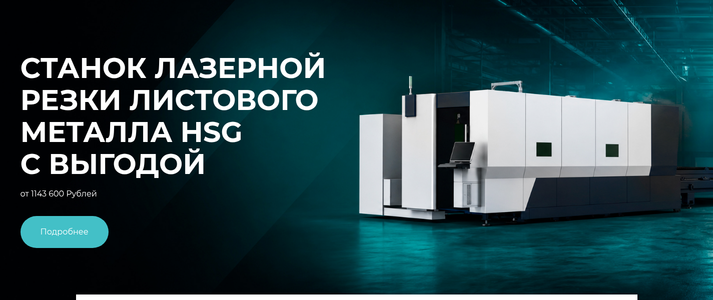

Где используется: https://barus.skalkindmitriy.ru/

Описание:
Задний фон баннера в характерных цветах Барус и с соответствующим наполнением с правой стороны акцентным элементом.

При правильном и рекомендуемом наполнении данного блока текстовые элементы выполнены посредством задания настроек в ПУ данного блока, поэтому на самой подложке лучше избегать важного текста или же учитывать зонирование и гармоничную встройку на баннере, чтобы была цельная картина.

Размер основной подложки: 3116×1203
Формат: WebP

На мобильной и планшетной версиях подложка своя. Акцентный элемент должен центрироваться, текст при этом переносится в нижнюю часть автоматически.

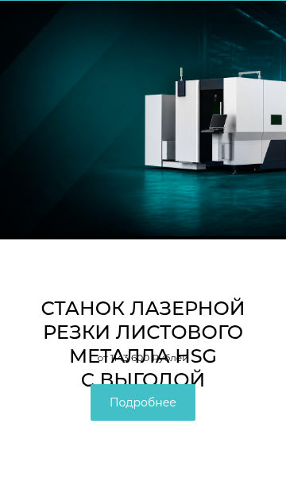

Размер сокращённой подложки под мобайл и таблет (анонс): 1064×779
Формат: WebP

Документация: https://sp.intecweb.ru/doc/courses/trebovaniya-k-graficheskim-materialam-1/
Минимально допустимый основной баннер по документации 1920×400, рекомендуемый 1920×550, максимальный 1920×600. Мобильный 320×300 или пропорционально этому размеру.

На тестовом сайте сейчас в слайде лежит один файл 1829×860 и на десктоп, и на мобайл, отдельной мобильной подложки нет, поэтому на телефоне картинка и текст расходятся некрасиво.

Демо примеры:
https://www.promcrm.ru/upload/iblock/f1b/ev02tew83088zonyl3b6axwucnwnupag.webp

Демо мобайл:
https://www.promcrm.ru/upload/iblock/b9d/kezyy4e91ihwky37dk47ik7n0q2ouqph.webp

Нужно для Барус: 3 основные подложки и 3 мобильные (по числу слайдов).

---

## 2. Вырезанный объект для мобильного баннера (главная страница)

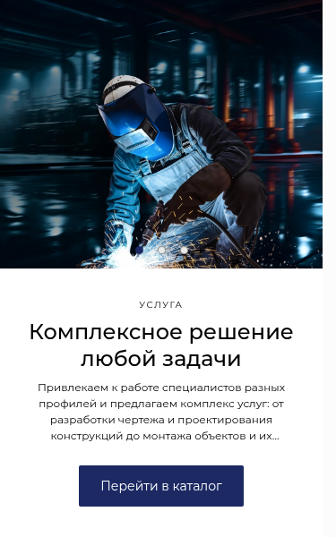

Где используется: https://barus.skalkindmitriy.ru/ (поле есть в каждом слайде, пока пустое)

Описание:
Отдельная картинка предмета без фона, третье поле в настройках слайда главного слайдера. На скриншоте демо-слайд с подписью «УСЛУГА» — это просто текст слайда, а не раздел услуг. Показывается только на телефонах и планшетах, ложится поверх мобильной подложки в верхней части экрана, текст и кнопка уходят под неё на белое поле.

Фон должен быть прозрачным, предмет по центру с запасом по краям, чтобы при обрезке ничего не срезало.

Размер основной: 880×733
Формат: WebP с прозрачностью или PNG

Анонс: нет, одна картинка.

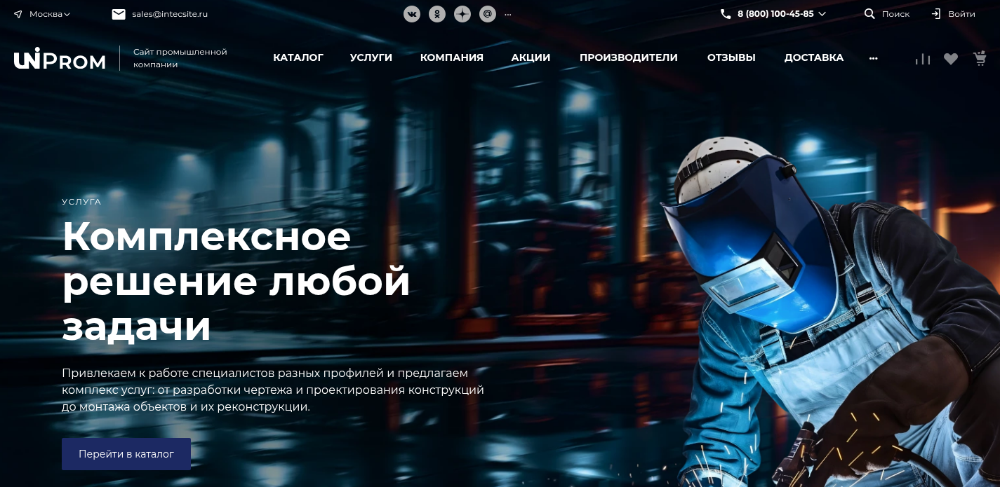

На десктопе этот файл не показывается, там работает только подложка из пункта 1.

Демо примеры:
https://metal.promcrm.ru/upload/iblock/a35/im77ip64oxfacm8nxphaywfrmphoxttk.webp
https://www.promcrm.ru/upload/iblock/1a7/9aek89b2nh3v0pdvv5zfvdgnfdjdx8lg.webp

Нужно для Барус: 3 шт. по числу слайдов, необязательно.

---

## 3. Иконки преимуществ (главная страница)

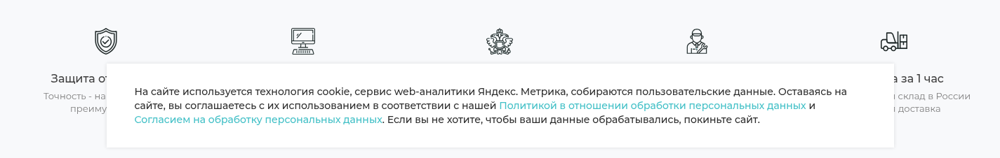

Где используется: https://barus.skalkindmitriy.ru/

Описание:
Блок из четырёх коротких тезисов под баннером. Иконка линейная, одноцветная, без подписей внутри картинки, весь текст задаётся в админке.

На мобильной версии блок разворачивается в четыре строки, иконка становится над текстом.

Размер основной: SVG, поле отрисовки 40×40. Растровый вариант 80×80.
Формат: SVG или PNG с прозрачностью

Анонс: нет, одна картинка.

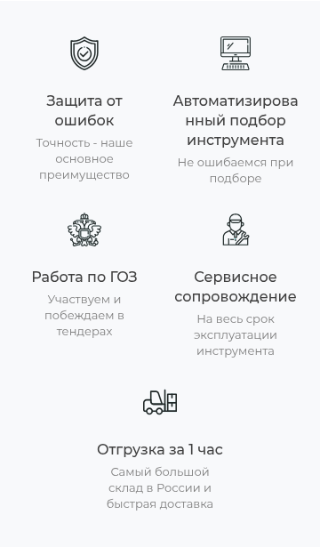

На тестовом сайте стоят встроенные иконки шаблона, они рисуются в поле 40×40.

Нужно для Барус: 4 шт.

---

## 4. Иконки разделов каталога (главная страница и корень каталога)

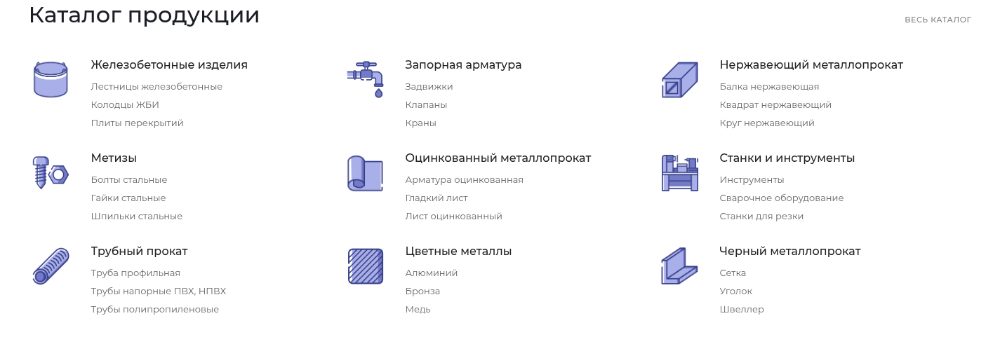

Где используется: https://barus.skalkindmitriy.ru/ и https://barus.skalkindmitriy.ru/catalog/

Описание:
Картинка раздела каталога. Одна и та же картинка идёт в список разделов на главной и в плитки корня каталога. Предмет по центру на прозрачном фоне, без подписей.

На главной картинка выводится в исходном размере, в корне каталога ужимается до 120×120.

Размер основной: 300×300
Формат: PNG с прозрачностью

Анонс: нет, одна картинка.

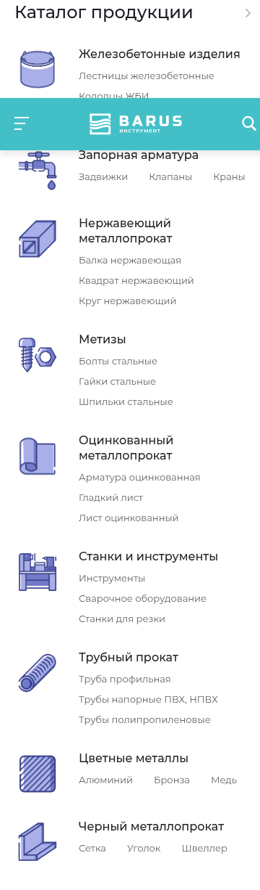

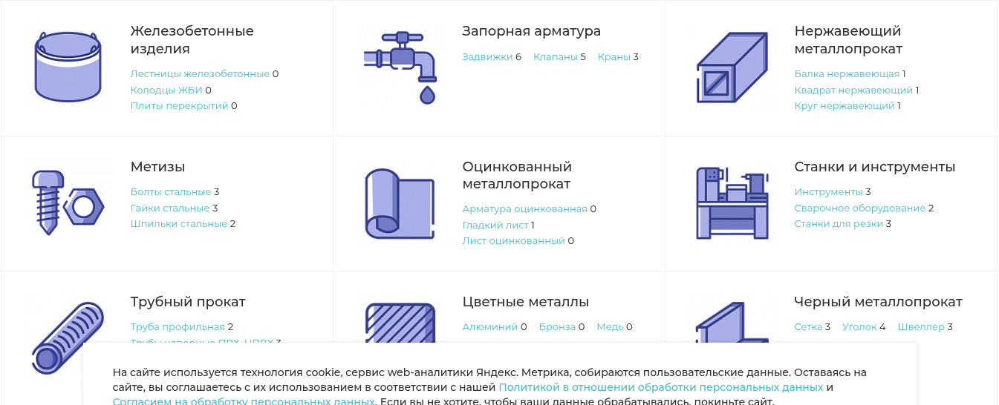

В демо лежат файлы от 130×137 до 188×186, поэтому на главной иконки выглядят мелко.

Демо примеры:
https://www.promcrm.ru/upload/iblock/33c/33c94ab324a7dacc446f328f8f3af9cb.png

Нужно для Барус: 8 шт. по числу категорий.

---

## 5. Иконки разделов в выпадающем меню каталога

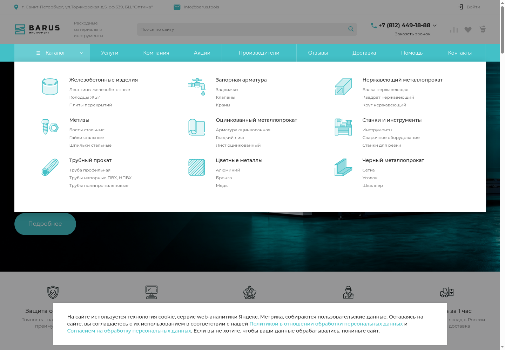

Где используется: https://barus.skalkindmitriy.ru/ (наведение на «Каталог» в шапке)

Описание:
Отдельное поле иконки раздела для шапки, задаётся в настройках меню. Рисуется квадратом 60×60 слева от названия раздела. Линия тонкая, одноцветная, без мелких деталей.

Размер основной: SVG, поле отрисовки 60×60. Растровый вариант 120×120.
Формат: SVG или PNG с прозрачностью

Анонс: нет, одна картинка.

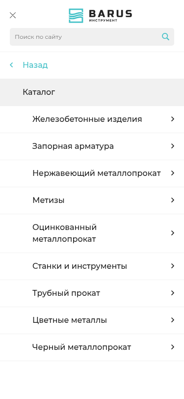

В мобильном меню при текущих настройках выводится текстовый список без картинок. Если включить плитки с картинками, туда пойдут эти же иконки.

Нужно для Барус: 8 шт. Если иконки из пункта 4 подойдут по стилю, можно использовать их и отдельный комплект не готовить.

---

## 6. Плитки отраслей (главная страница)

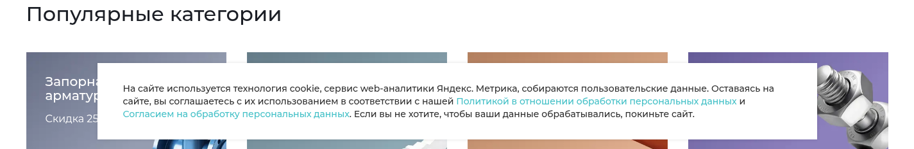

Где используется: https://barus.skalkindmitriy.ru/

Описание:
Блок «Категории плитки 8», горизонтальные плитки с фото и названием отрасли. Название выводится поверх картинки настройками блока, на самой картинке текста быть не должно.

Картинка выводится в исходном размере, на мобильной версии плитки перестраиваются в одну колонку и та же картинка обрезается по бокам.

Размер основной: 500×247
Формат: WebP

Анонс: нет, одна картинка.

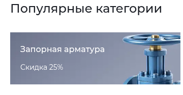

Демо примеры:
https://www.promcrm.ru/upload/iblock/39d/00snb26g7lmtvh1dx120ezi9tpuav5w1.webp

Нужно для Барус: 8 шт.

---

## 7. Картинки акций

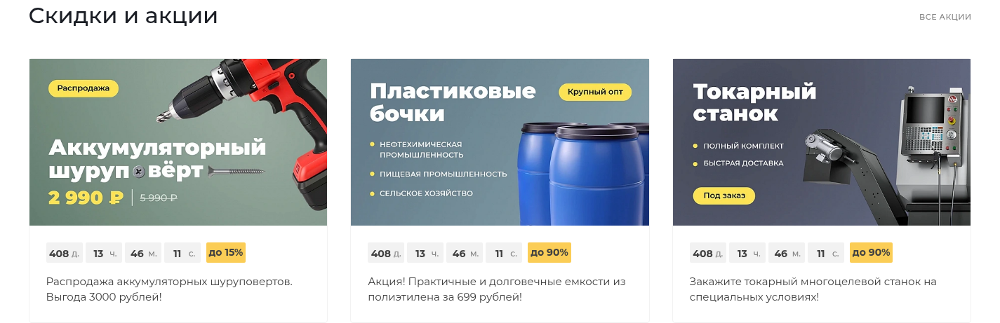

Где используется: https://barus.skalkindmitriy.ru/ и https://barus.skalkindmitriy.ru/shares/

Описание:
Картинка акции. На главной выводится в плитке 600×409, в разделе акций ужимается до 480×313. Заголовок, срок и кнопка рисуются шаблоном рядом с картинкой, на картинке текста быть не должно.

Размер основной: 880×600
Формат: WebP

Анонс: нет, одна картинка.

Внутри карточки акции отдельно загружается широкий баннер, у него два поля, для десктопа и для мобильной версии.

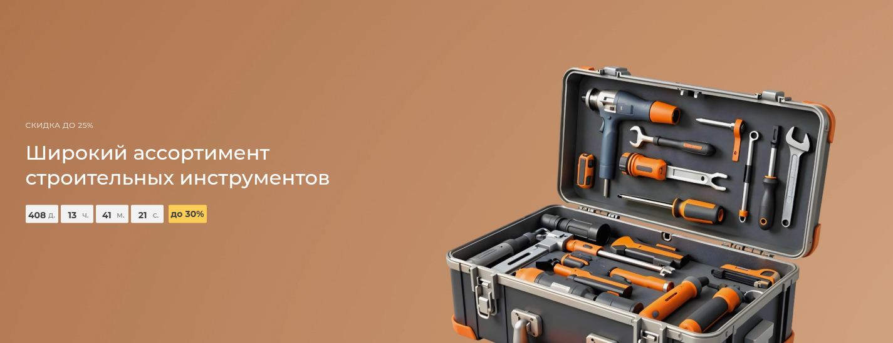

Размер баннера акции, десктоп: 3720×1100
Формат: WebP

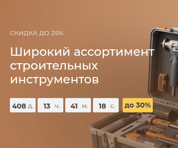

Размер баннера акции, мобайл: 1056×600
Формат: WebP

Страница акции: https://barus.skalkindmitriy.ru/shares/446/

Демо примеры:
https://www.promcrm.ru/upload/iblock/22e/98blfercpd5efzzvg2lw3pohm6rtygvh.webp

Демо баннер акции:
https://barus.skalkindmitriy.ru/upload/iblock/a80/qncnn8v0ht0ma9o57ooajwr9w4qujxpw.webp

Демо баннер акции, мобайл:
https://barus.skalkindmitriy.ru/upload/iblock/4dc/vijxxq4a373xv99mzko8u36w1g51701l.webp

Нужно для Барус: 3 картинки акций, к ним по паре баннеров на те акции, где нужна отдельная посадочная.

---

## 8. Фоны плиток услуг (главная страница)

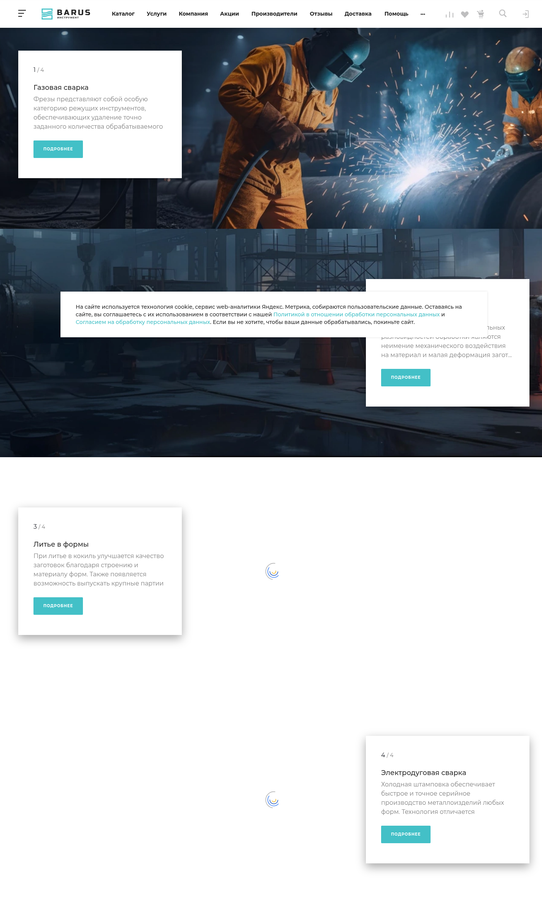

Где используется: https://barus.skalkindmitriy.ru/

Описание:
Блок «Услуги, плитки 8». Фон растягивается на всю ширину плитки, название услуги и кнопка лежат поверх него слева. Картинка тёмная или затемняется под светлый текст, важные детали ближе к правому краю.

Картинка выводится в исходном размере, без ужатия.

Размер основной: 2070×450
Формат: WebP

Анонс: нет, одна картинка.

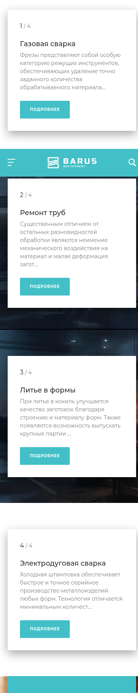

На мобильной версии плитка сжимается, картинка обрезается по бокам, центр остаётся на месте.

В демо лежат файлы 2069×450 и 2460×535.

Демо примеры:
https://barus.skalkindmitriy.ru/upload/iblock/1e4/7ww7x59lxcth8spkuuzh9c4yy3cnxcpx.webp

Нужно для Барус: 4 шт.

---

## 9. Фото проектов

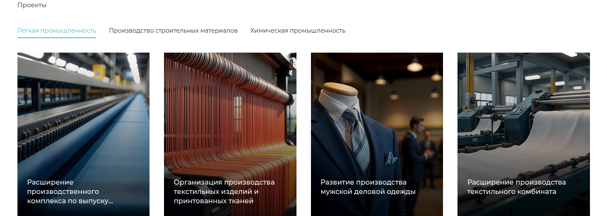

Где используется: https://barus.skalkindmitriy.ru/ и https://barus.skalkindmitriy.ru/company/projects/

Описание:
Фотография выполненного проекта. На главной ужимается до 700×461, в разделе проектов до 683×450, в карточке проекта показывается оригинал во всю ширину галереи.

Живая съёмка объекта или цеха, без логотипов и подписей поверх фото.

Размер основной: 1500×988
Формат: WebP

Анонс: нет, одна картинка.

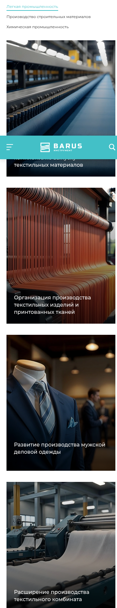

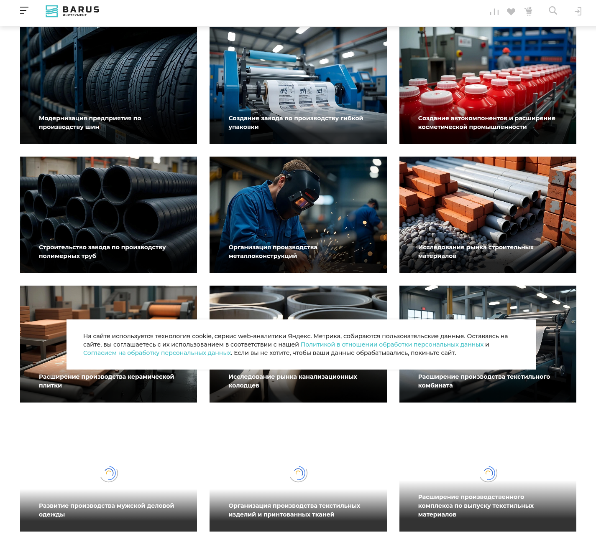

Внутри карточки проекта галерея: миниатюры 256×169, по клику открывается оригинал.

Демо примеры:
https://barus.skalkindmitriy.ru/upload/iblock/65e/8tvawkjbn7lo0qqg1ywa5apyu94vu2ef.webp

Нужно для Барус: 6 шт. на старт, по 3-6 кадров в каждой карточке проекта.

---

## 10. Фото статей

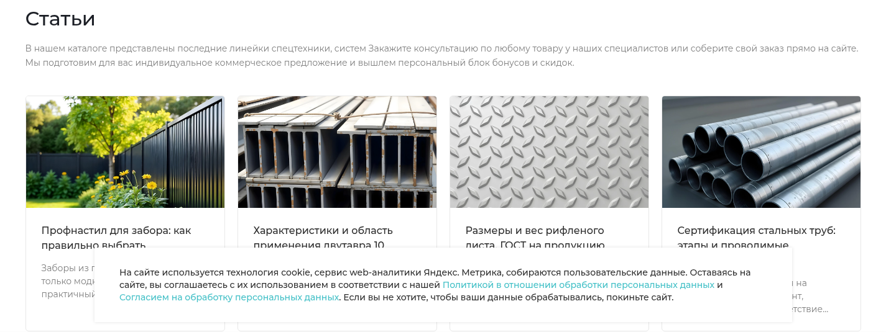

Где используется: https://barus.skalkindmitriy.ru/company/articles/ и блок статей на главной

Описание:
Заглавная картинка статьи. На главной выводится в исходном размере, в списке статей ужимается до 600×425, в самой статье показывается оригинал.

Размер основной: 1200×850
Формат: WebP

Анонс: нет, одна картинка.

Демо примеры:
https://barus.skalkindmitriy.ru/upload/iblock/8c8/pov5opej4t70j4mo8swqugv3vzawuqun.webp

Нужно для Барус: 5 шт. на старт.

---

## 11. Фото новостей

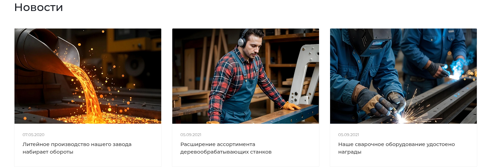

Где используется: https://barus.skalkindmitriy.ru/company/news/ и блок новостей на главной

Описание:
Заглавная картинка новости. Одна и та же картинка расходится по нескольким местам: на главной 700×494, в списке новостей 1135×800, в самой новости оригинал, в карточке товара в блоке новостей 350×247, в связанных новостях квадрат 200×200.

Из-за квадратной обрезки в связанных новостях главный объект должен быть ближе к центру кадра.

Размер основной: 1200×846
Формат: WebP

Анонс: нет, одна картинка.

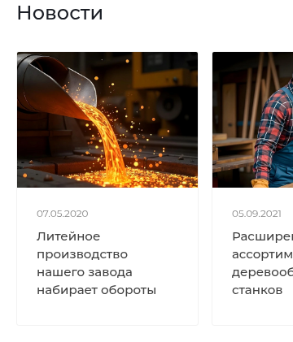

Демо примеры:
https://www.promcrm.ru/upload/iblock/095/36rk6vt9t9v3d8bucpe8jnjle59sk8t0.webp

Нужно для Барус: 6 шт. на старт.

---

## 12. Логотипы брендов

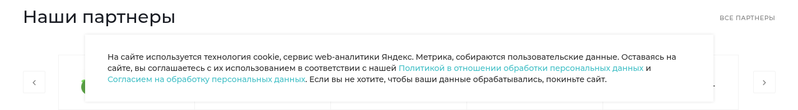

Где используется: https://barus.skalkindmitriy.ru/ и https://barus.skalkindmitriy.ru/brands/

Описание:
Логотип производителя на прозрачном фоне. Шаблон вписывает его по ширине: в слайдере на главной и на странице брендов по ширине 400, в карточке товара по ширине 110 и 80.

Фон обязательно прозрачный, поля вокруг логотипа минимальные, иначе логотип визуально теряется.

Размер основной: 500×150
Формат: PNG с прозрачностью

Анонс: нет, одна картинка.

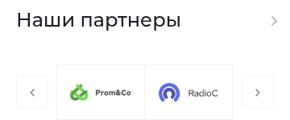

В демо лежат файлы от 416×130 до 734×139.

Демо примеры:
https://www.promcrm.ru/upload/iblock/9b3/wpakpmoewqtd8l2z2lu7poxhrjk1cdhz.png

Нужно для Барус: по числу брендов, на старт 10-15 шт.

---

## 13. Картинка блока «О компании» (главная страница)

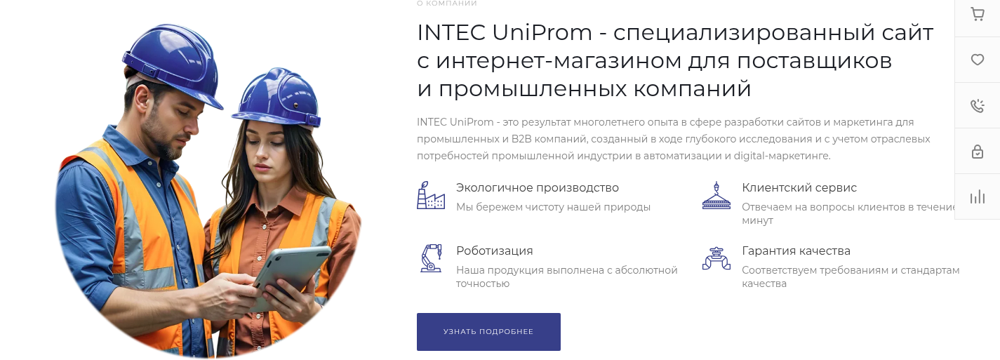

Где используется: https://barus.skalkindmitriy.ru/ (блок на тестовом сайте пока не включён)

Описание:
Вертикальная фотография рядом с текстом о компании. Выводится в исходном размере, текст и цифры стоят слева от неё.

Живая съёмка производства или склада, без текста на фото.

Размер основной: 699×812
Формат: WebP

Анонс: нет, одна картинка.

На телефонах и планшетах шаблон это фото не показывает, остаётся только текст с цифрами и кнопкой.

Демо примеры:
https://www.promcrm.ru/upload/iblock/968/nlox0l94qym8gkouaba6rfbsxspyfn6d.webp

Нужно для Барус: 1 шт.

---

## 14. Фото товара

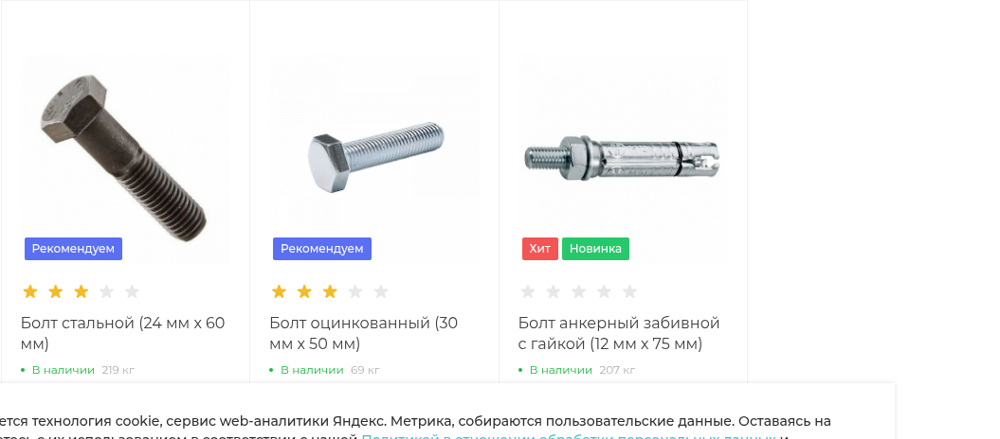

Где используется: https://barus.skalkindmitriy.ru/catalog/bolty_stalnye/?view=tile и https://barus.skalkindmitriy.ru/catalog/bolty_stalnye/378/

Описание:
Предметная съёмка товара на белом фоне. Одна картинка расходится по всему сайту: плитка каталога 450×450, миниатюра в карточке 64×64, мелкие превью в списках 56×56 и 115×115, в самой карточке товара показывается оригинал.

Формат кадра квадратный, товар по центру с одинаковыми полями, иначе в мелких квадратных превью он срежется.

Размер основной: 1000×1000
Формат: JPEG на белом фоне

Анонс: нет, одна картинка. Если у товара загружена только детальная картинка, все превью шаблон строит из неё сам.

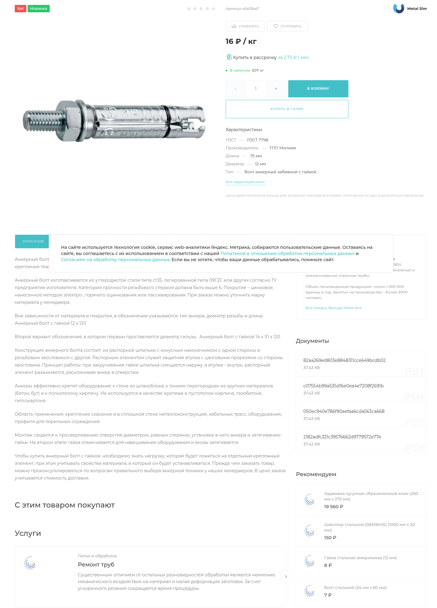

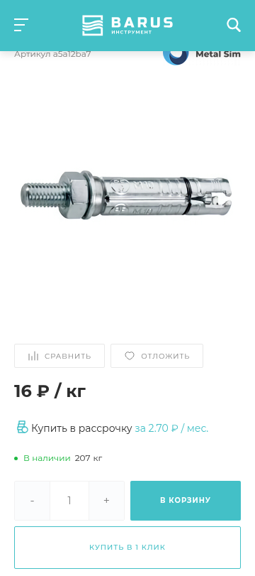

В демо лежат файлы 640×640, 700×700, 920×920 и 1500×1500.

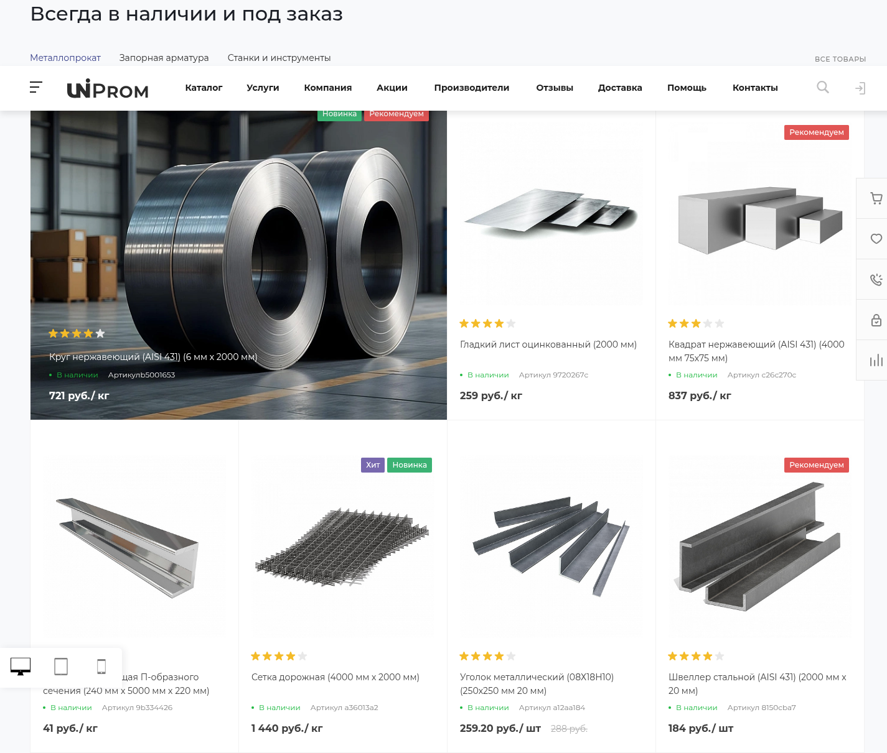

В блоке товаров на главной та же картинка выводится крупной плиткой по ширине 700 и мелкими плитками 450×450.

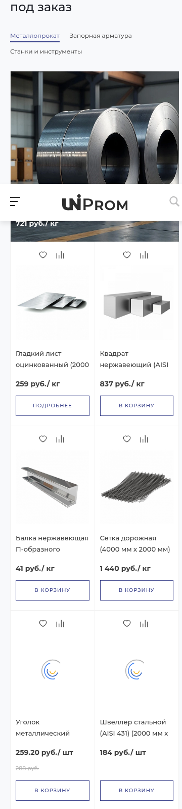

Демо примеры:
https://barus.skalkindmitriy.ru/upload/iblock/f4b/pjk1ieehaeclkwp24k2ppnukjh6sy30b.jpg
https://www.promcrm.ru/upload/iblock/0e1/cg9ct3epjw8y8070bvud1csw3avc2xee.webp

Нужно для Барус: по числу товаров, минимум по одному кадру на позицию.

---

## 15. Превью видео

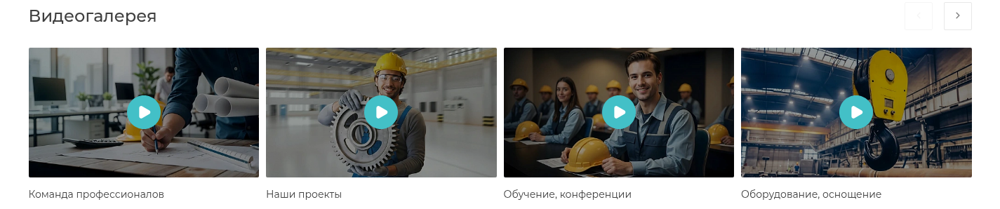

Где используется: https://barus.skalkindmitriy.ru/catalog/bolty_stalnye/378/ и https://barus.skalkindmitriy.ru/services/rezka_materialov/424/

Описание:
Картинка-заставка для видеоролика. Поверх неё шаблон рисует круглую кнопку воспроизведения по центру, поэтому в центре кадра не должно быть важных деталей.

Выводится в блоке 500×290, соотношение сторон 16:9.

Размер основной: 900×522
Формат: WebP

Анонс: нет, одна картинка.

Демо примеры:
https://barus.skalkindmitriy.ru/upload/iblock/364/xea7emaiqyjnynenedq15czcc1trudg4.webp

Нужно для Барус: по числу роликов, на старт 2-3 шт.

---

## 16. Фото разделов услуг

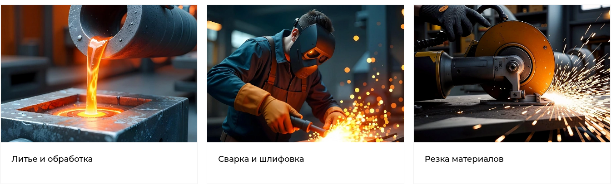

Где используется: https://barus.skalkindmitriy.ru/services/

Описание:
Картинка раздела услуг в корне раздела. Ужимается до 600×419, название раздела выводится под картинкой.

Размер основной: 764×534
Формат: WebP

Анонс: нет, одна картинка.

Демо примеры:
https://barus.skalkindmitriy.ru/upload/iblock/d5d/72bfmjvntq1pt0sn15domlruwee4wx9b.webp

Нужно для Барус: по числу разделов услуг, на старт 4-6 шт.

---

## 17. Фото услуги

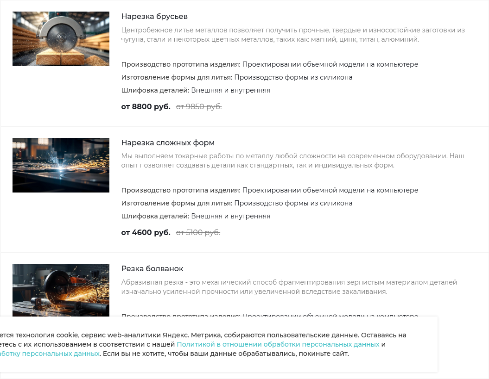

Где используется: https://barus.skalkindmitriy.ru/services/rezka_materialov/

Описание:
Картинка конкретной услуги. В списке раздела выводится в исходном размере, в карточке акции той же картинкой строится плитка 800×450, в карточке товара квадрат 300×300 и мелкое превью 115×115.

Из-за квадратной обрезки главный объект держим по центру кадра.

Размер основной: 1000×562
Формат: WebP

Анонс: нет, одна картинка.

Демо примеры:
https://barus.skalkindmitriy.ru/upload/iblock/a0a/p7kkw455s4btl4s8grtiz6p3lo0il6v1.webp
https://www.promcrm.ru/upload/iblock/45a/rcfkiwl045tosmgyivb6grk2bx989c60.webp

Нужно для Барус: по числу услуг, на старт 10-15 шт.

---

## 18. Баннер в карточке услуги

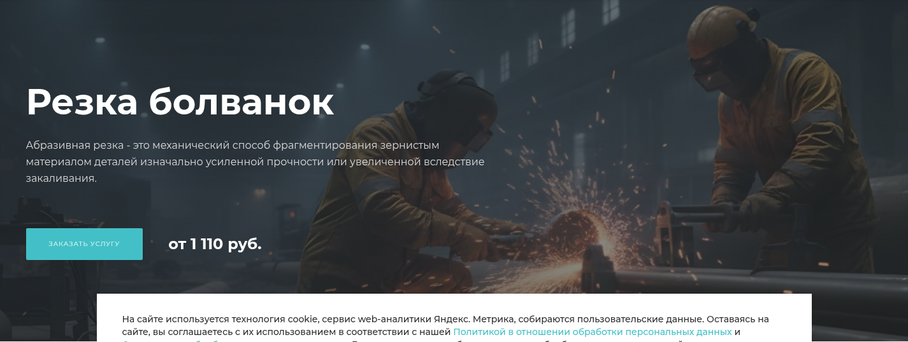

Где используется: https://barus.skalkindmitriy.ru/services/rezka_materialov/424/

Описание:
Широкая полоса в верхней части карточки услуги. Заголовок и кнопка выводятся поверх настройками блока, на картинке текста быть не должно.

Растягивается на всю ширину экрана, по краям обрезается, поэтому смысловая часть кадра должна быть по центру.

Размер основной: 2070×450
Формат: WebP

Анонс: нет, одна картинка.

Демо примеры:
https://barus.skalkindmitriy.ru/upload/iblock/99f/my1iuokv8586a8bnfhtu12w0haqdf74x.webp

Нужно для Барус: 1 общий баннер или по одному на каждую услугу.

---

## 19. Галерея работ в карточке услуги

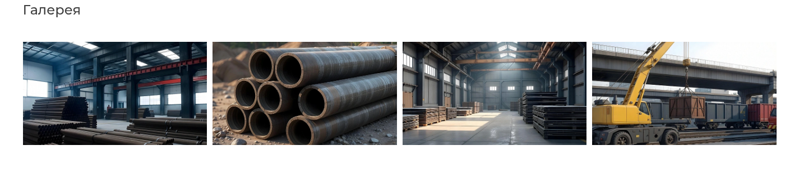

Где используется: https://barus.skalkindmitriy.ru/services/rezka_materialov/424/

Описание:
Набор фотографий выполненных работ внутри карточки услуги. В сетке выводится по 700×492, по клику открывается оригинал во весь экран.

Размер основной: 1150×808
Формат: WebP

Анонс: нет, одна картинка.

Демо примеры:
https://barus.skalkindmitriy.ru/upload/iblock/9fa/ar220cjewb9ra0amsyfqk28lg296dev9.webp

Нужно для Барус: 4-8 кадров на услугу.

---

## 20. Фото автора отзыва

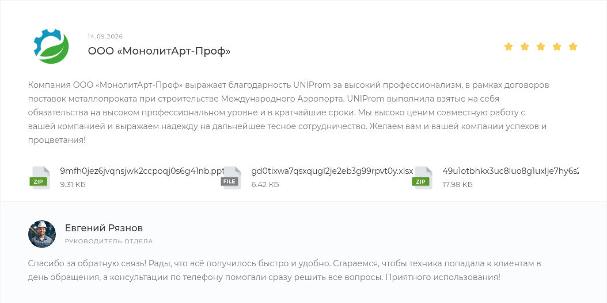

Где используется: https://barus.skalkindmitriy.ru/company/reviews/

Описание:
Портрет или логотип компании, оставившей отзыв. Обрезается в квадрат по центру: в разделе отзывов 120×120, в блоке отзывов на главной 128×128, в карточке услуги 64×64.

Лицо или знак держим по центру кадра с запасом по краям.

Размер основной: 300×300
Формат: PNG с прозрачностью для логотипов, JPEG для портретов

Анонс: нет, одна картинка.

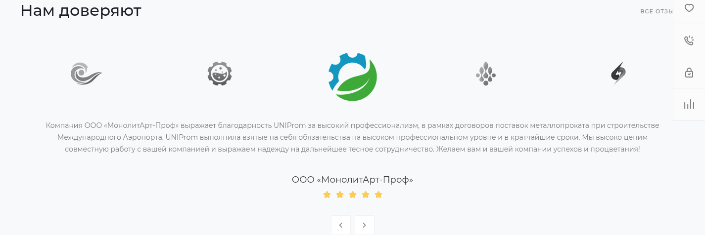

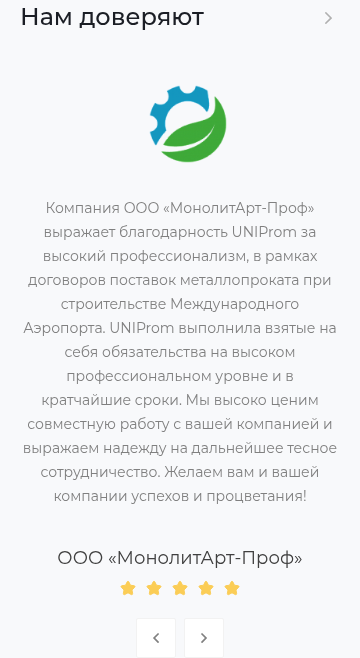

Отдельным полем загружается портрет сотрудника, который отвечает на отзыв, он выводится квадратом 64×64. В демо там лежит файл 501×501.

В демо портреты авторов лежат в размерах 165×165, 175×175 и 180×180.

Демо примеры:
https://www.promcrm.ru/upload/iblock/69e/69e83b68178ad47b39c3eaffd172decc.png
https://barus.skalkindmitriy.ru/upload/iblock/7db/j70thv1e1am0afy0u4dlhnmpdglxyr71.webp

Нужно для Барус: 3-6 шт. плюс 1-2 портрета отвечающих сотрудников.

---

## 21. Скан или фото к отзыву

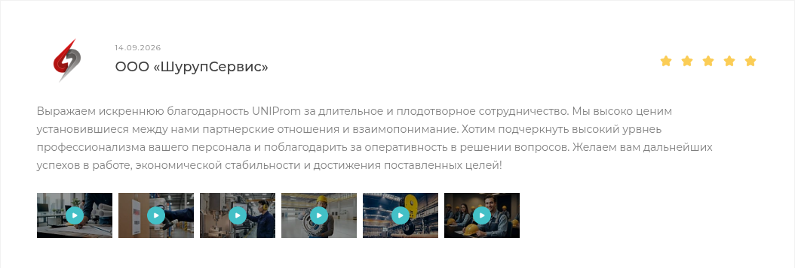

Где используется: https://barus.skalkindmitriy.ru/company/reviews/

Описание:
Приложение к отзыву: скан благодарственного письма, фото объекта или кадр из видео. В ленте выводится миниатюрами 120×70, по клику открывается оригинал.

Для скана письма кадр вертикальный, для фото объекта горизонтальный.

Размер основной: 900×522 для фото, 850×1200 для скана письма
Формат: WebP или JPEG

Анонс: нет, одна картинка.

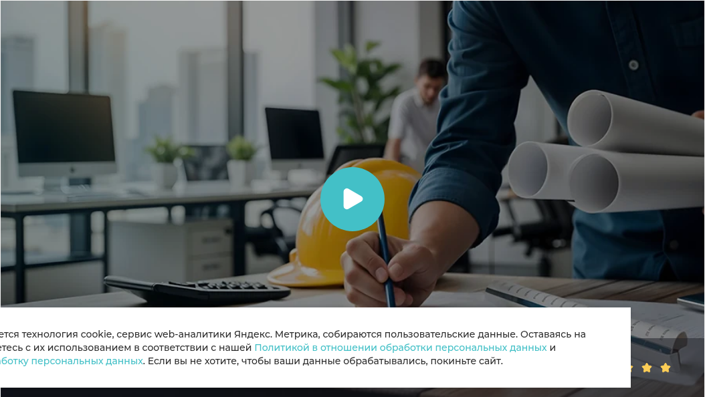

Если к отзыву прикладывается видео, к нему нужна заставка 900×522 и квадратный портрет говорящего 175×175, он выводится кружком 72×72.

Демо примеры:
https://barus.skalkindmitriy.ru/upload/iblock/364/xea7emaiqyjnynenedq15czcc1trudg4.webp
https://barus.skalkindmitriy.ru/upload/iblock/e7c/mghoqxbclse7736qvdst6gciv5s29q86.png

Нужно для Барус: 3-6 шт.

---

## 22. Сертификаты и документы

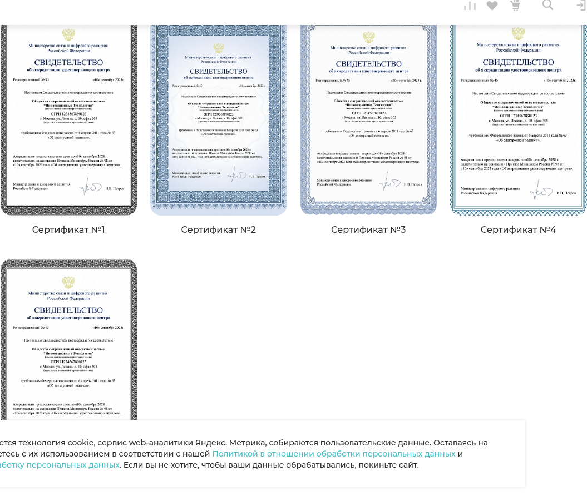

Где используется: https://barus.skalkindmitriy.ru/company/certificates/

Описание:
Скан сертификата или свидетельства вертикальным кадром. В плитке выводится 353×500, по клику открывается оригинал во весь экран, поэтому скан должен быть читаемым.

Размер основной: 848×1200
Формат: WebP

Анонс: нет, одна картинка.

Демо примеры:
https://barus.skalkindmitriy.ru/upload/iblock/cd4/r7rufby8183y334bhummzluxfx5x1gmu.webp

Нужно для Барус: 5-10 шт.

---

## 23. Фото сотрудников

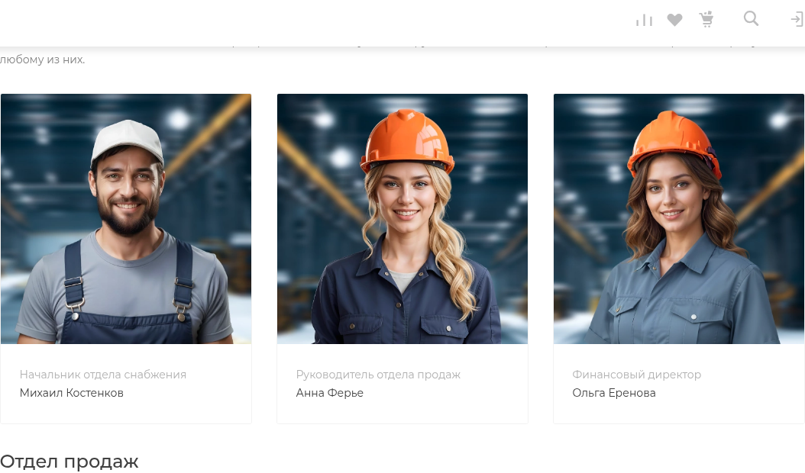

Где используется: https://barus.skalkindmitriy.ru/company/staff/

Описание:
Портрет сотрудника квадратным кадром. Выводится в исходном размере, поэтому кадры у всех сотрудников должны быть одного размера и одного фона.

Размер основной: 500×500
Формат: WebP

Анонс: нет, одна картинка.

Демо примеры:
https://barus.skalkindmitriy.ru/upload/iblock/4c3/vrwuqyl57rgrpdv8m12b6gnctbkdecar.webp

Нужно для Барус: по числу сотрудников на странице, на старт 5-10 шт.

---

## 24. Фото контактного лица вакансии

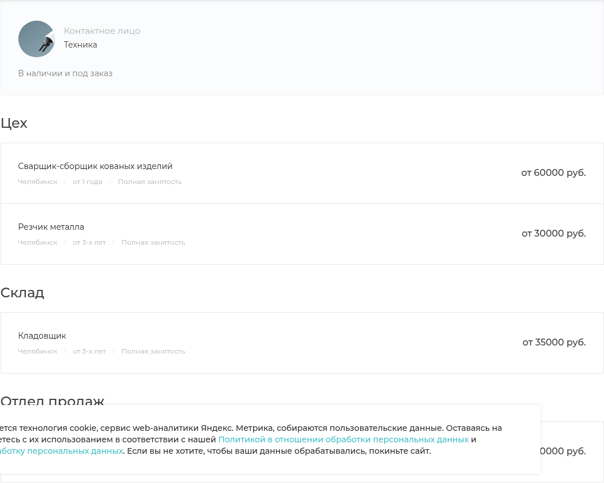

Где используется: https://barus.skalkindmitriy.ru/company/jobs/

Описание:
Портрет сотрудника отдела кадров рядом с контактами в карточке вакансии. Вписывается в поле 100×100, кадр квадратный.

Размер основной: 300×300
Формат: WebP

Анонс: нет, одна картинка.

В демо туда загружен горизонтальный файл 500×247, из-за этого портрет выводится полосой 100×49.

Нужно для Барус: 1-2 шт.

---

## 25. Фото офиса и склада на контактах

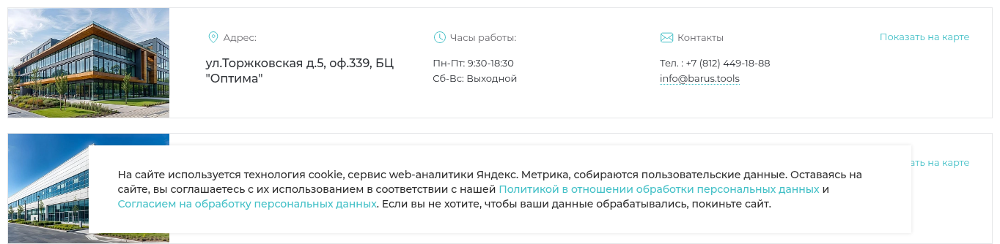

Где используется: https://barus.skalkindmitriy.ru/contacts/

Описание:
Фотография офиса, склада или входа рядом с адресом. В списке офисов выводится 360×240, по клику открывается оригинал.

Размер основной: 1000×666
Формат: WebP

Анонс: нет, одна картинка.

Демо примеры:
https://barus.skalkindmitriy.ru/upload/iblock/540/q7p5muemh0b79pateh1778oe6qbse7aa.webp

Нужно для Барус: по одному кадру на адрес, на старт 1-3 шт.

---

## 26. Картинки подборок

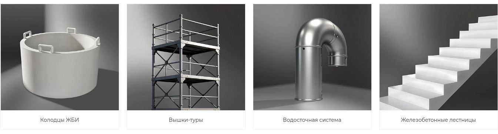

Где используется: https://barus.skalkindmitriy.ru/collections/

Описание:
Обложка тематической подборки товаров. Выводится плиткой 476×430, название подборки идёт под картинкой.

Размер основной: 750×677
Формат: WebP

Анонс: нет, одна картинка.

Демо примеры:
https://barus.skalkindmitriy.ru/upload/iblock/dfc/7z1488n5y7sujf2d70pioz8jjcrhbdmu.webp

Нужно для Барус: 3-6 шт.

---

## 27. Фотогалерея компании

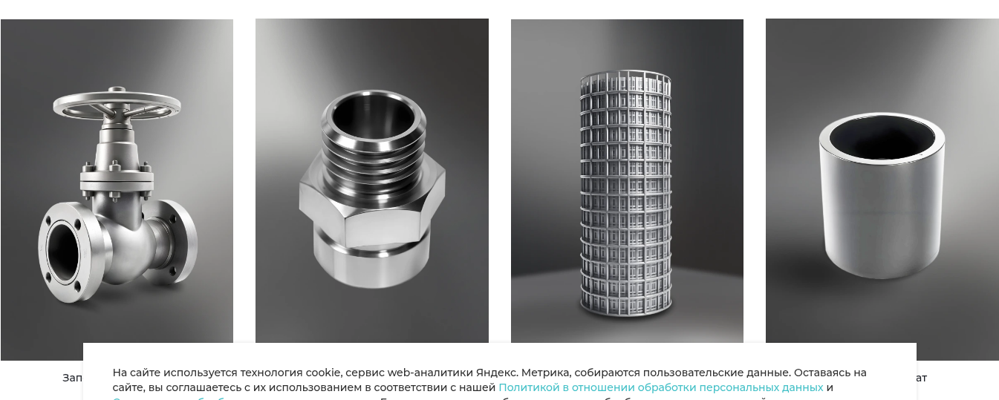

Где используется: https://barus.skalkindmitriy.ru/imagery/

Описание:
Кадры производства, склада и команды в общей галерее. Выводятся в исходном размере кирпичной кладкой, вертикальные и горизонтальные кадры можно смешивать.

Размер основной: 564×828
Формат: WebP

Анонс: нет, одна картинка.

Демо примеры:
https://barus.skalkindmitriy.ru/upload/iblock/668/x2xi66qfnko9o8x8qdtjzy9qiszjrcv1.webp

Нужно для Барус: 8-20 шт.

---

## 28. Логотип

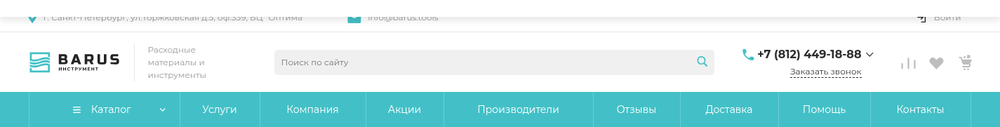

Где используется: https://barus.skalkindmitriy.ru/ (шапка, футер, мобильное меню)

Описание:
Один и тот же файл логотипа шаблон подставляет в шапку, в футер и в мобильное меню. В шапке он рисуется в размере 131×32.

На тестовом сайте уже стоит боевой логотип Барус в SVG, он тянется без потери качества на любом экране.

Размер основной: SVG. Растровый вариант 260×64.
Формат: SVG или PNG с прозрачностью

Анонс: нет, одна картинка.

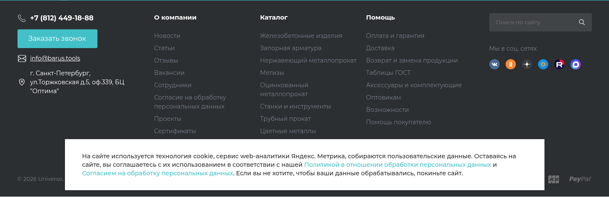

Для тёмного футера нужен отдельный светлый вариант логотипа.

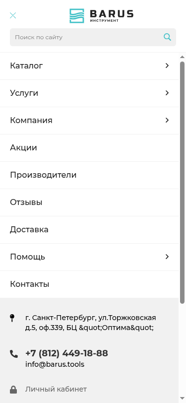

Документация: https://sp.intecweb.ru/doc/courses/nastroyki-shapki/razmer-logotipa/
Рекомендуемый размер логотипа 130×50, эти значения считаются максимально допустимыми.

Документация: https://sp.intecweb.ru/doc/courses/shapka/iskazhenie-logotipa/
В мобильной и фиксированной шапке высота логотипа обрезается до 24 px.

Нужно для Барус: горизонтальный тёмный 1 шт., светлый для футера 1 шт., вертикальный для нижней полосы 1 шт.

---

## 29. Favicon

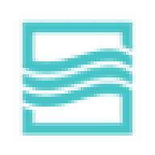

Где используется: https://barus.skalkindmitriy.ru/favicon.ico (иконка во вкладке браузера и в закладках)

Описание:
Знак Барус без надписи, читаемый в квадрате 16 пикселей. Тонкие линии и мелкие детали на таком размере пропадают, поэтому нужен упрощённый знак.

Размер основной: ICO с наборами 16×16, 32×32 и 48×48
Формат: ICO

Дополнительно нужны PNG 180×180 для иконки на экране айфона и PNG 512×512 для Android.

Анонс: нет, одна картинка.

Сейчас на сайте лежит ICO 48×48, файл apple-touch-icon объявлен в шаблоне, но отсутствует.

Нужно для Барус: 1 комплект.

---

## 30. Картинка компании для соцсетей и микроразметки

Где используется: https://barus.skalkindmitriy.ru/include/logotype.png

Описание:
Отдельный растровый логотип, который шаблон отдаёт в микроразметку организации и в превью ссылки при отправке в мессенджеры и соцсети. Загружается файлом по этому же адресу.

Размер основной: 206×50
Формат: PNG

Для нормального превью ссылки дополнительно нужна широкая картинка 1200×630 с логотипом по центру на фирменном фоне.

Анонс: нет, одна картинка.

Нужно для Барус: 1-2 шт.

---

## Сводка размеров

| № | Материал | Основной размер | Мобильный или анонс | Формат | Кол-во |
|---|---|---|---|---|---|
| 1 | Подложка баннера | 3116×1203 | 1064×779 | WebP | 3 + 3 |
| 2 | Объект для мобильного баннера | 880×733 | нет | WebP прозрачный | 3 |
| 3 | Иконки преимуществ | 40×40 SVG или 80×80 PNG | нет | SVG / PNG | 4 |
| 4 | Иконки разделов каталога | 300×300 | нет | PNG прозрачный | 8 |
| 5 | Иконки разделов в меню шапки | 60×60 SVG или 120×120 PNG | нет | SVG / PNG | 8 |
| 6 | Плитки отраслей | 500×247 | нет | WebP | 8 |
| 7 | Картинки акций | 880×600 | баннер 3720×1100 и 1056×600 | WebP | 3 |
| 8 | Фоны плиток услуг | 2070×450 | нет | WebP | 4 |
| 9 | Фото проектов | 1500×988 | нет | WebP | 6 |
| 10 | Фото статей | 1200×850 | нет | WebP | 5 |
| 11 | Фото новостей | 1200×846 | нет | WebP | 6 |
| 12 | Логотипы брендов | 500×150 | нет | PNG прозрачный | 10-15 |
| 13 | Картинка «О компании» | 699×812 | нет | WebP | 1 |
| 14 | Фото товара | 1000×1000 | нет | JPEG белый фон | по числу товаров |
| 15 | Превью видео | 900×522 | нет | WebP | 2-3 |
| 16 | Фото разделов услуг | 764×534 | нет | WebP | 4-6 |
| 17 | Фото услуги | 1000×562 | нет | WebP | 10-15 |
| 18 | Баннер в карточке услуги | 2070×450 | нет | WebP | 1-3 |
| 19 | Галерея работ в услуге | 1150×808 | нет | WebP | 4-8 |
| 20 | Фото автора отзыва | 300×300 | нет | PNG / JPEG | 3-6 |
| 21 | Скан или фото к отзыву | 900×522 или 850×1200 | нет | WebP / JPEG | 3-6 |
| 22 | Сертификаты | 848×1200 | нет | WebP | 5-10 |
| 23 | Фото сотрудников | 500×500 | нет | WebP | 5-10 |
| 24 | Контактное лицо вакансии | 300×300 | нет | WebP | 1-2 |
| 25 | Фото офиса | 1000×666 | нет | WebP | 1-3 |
| 26 | Картинки подборок | 750×677 | нет | WebP | 3-6 |
| 27 | Фотогалерея | 564×828 | нет | WebP | 8-20 |
| 28 | Логотип | SVG или 260×64 | светлый для футера | SVG / PNG | 3 |
| 29 | Favicon | ICO 16/32/48 | 180×180 и 512×512 PNG | ICO / PNG | 1 комплект |
| 30 | Картинка для соцсетей | 206×50 и 1200×630 | нет | PNG / JPEG | 1-2 |
